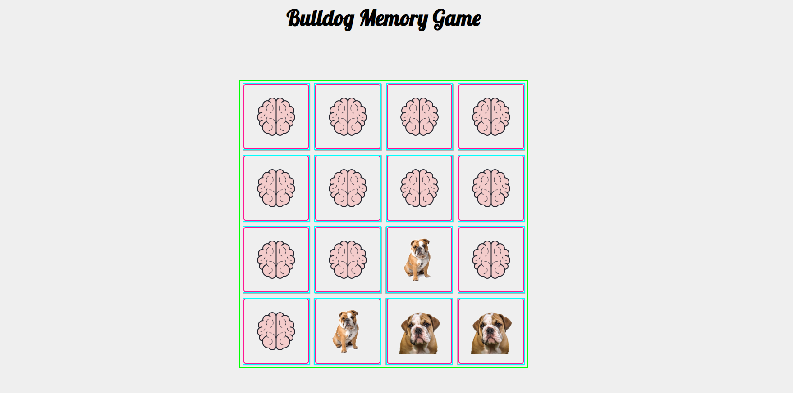

# match-dog-memory-game
memory matching game!

## Tools Used
Vanilla Javascript, Flexbox

## Url
https://stephenstuder/match-dog-memory-game/

## Screenshot

## Future Improvements
This project is in need of a scoring system. I would probably do some sort of timer that deducts seconds for an incorrect match. Also the ability to choose easy, medium or difficult would be a nice addition as well. 